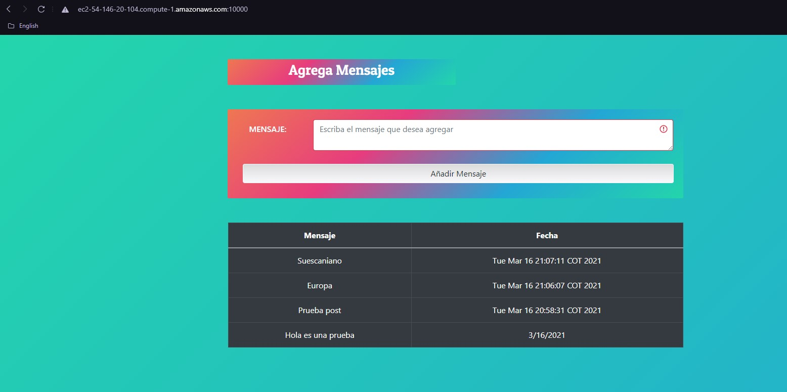

# AREP-SparkDockerWebApp
## Autor
**Nikolai Bermudez Vega** - Trabajo AREP-DockerSparkWebApp
## Resumen
El objetivo de este laboratorio es implementar un aplicativo web usando el framework de Spark para java, con la cual se construirá un contenedor docker para la aplicación y se configurará para nuestra máquina local.
Posteriormente crearemos un repositorio en DockerHub y subiremos la imagen al repositorio.
Finalmente crearemos una máquina virtual en AWS, instalaremos Docker y desplegaremos el contenedor creado anteriormente para poder utilizar el aplicativo web.

El aplicativo web cuenta con un balanceador de carga y tres nodos, el balanceador se encargará de enviar las peticiones a los distintos nodos mediante el algoritmo de balanceo de cargas de Round Robin.
Estos nodos se conectarán a una base de datos mongo para poder obtener los datos y retornarlos.

La arquitectura descrita anteriormente se puede ver en la siguiente imagen.


#### Integración Continua
[](https://circleci.com/gh/Nikolai9906/AREP-LAB-3)
  ## Diseño
 Los detalles del diseño, la arquitectura del programa, problema, definiciones y pruebas se pueden encontrar en el siguiente documento [Artículo Sobre el Diseño](ArquitecturaDockerSparkWebApp.pdf).
   
 ## Prerequisitos
 Tener instalado:
 - Java.
 - Maven.
 - Docker.
 
 Entender sobre peticiones http, docker (contenedores), servidores y demás, así como el lenguaje JAVA en el que fue realizado este proyecto.
 
 ## Comandos 
  Para compilar y correr las pruebas: ```mvn package```
  
  Para ejecutar y utilizar los aplicativos: ```mvn exec:java -Dexec.mainClass="edu.escuelaing.arep.App"```
  
  Para generar javadoc con maven: ```mvn javadoc:javadoc```
  
  Para generar javadoc de las pruebas: ```mvn javadoc:test-javadoc```
  
  **IMPORTANTE:** Para poder utilizar el aplicativo es necesario compilar primero el proyecto con **mvn package**.
 
 ## ¿Cómo usar el aplicativo?
 Descargue o clone el repositorio con el siguiente comando.
 
    git clone https://github.com/Nikolai9906/AREP-LAB-5
    
Acceda a los proyectos LoadBalancer y SparkWebApp y compile cada proyecto con el comando.

    mvn package

Luego acceda al directorio DockerCompose y ejecute el siguiente comando para crear los contenedores en docker y poder utilizar el aplicativo.

    docker-compose up -d --scale web=3

 ## Operaciones
 - **GET**: Permite realizar peticiones get definidas por el usuario como (retornar los mensajes en este caso).
 	- **/mensajes**: Es la operación encargada de dar todos los mensajes.
 - **POST**: Permite realizar peticiones post definidas por el usuario como (insertar un nuevo mensaje).
 	- **/addMensaje**: Es la operación encargada de añadir un nuevo mensaje.


## Pruebas
### Docker-Compose


### Local


### AWS


##El proceso se detuvo debido a que cada dia que pasa se genera un cobro a la suscripcion de AWS :round_pushpin:

## Construido 
- [Eclipse](https://www.eclipse.org/) Editor de JAVA donde se puede compilar el proyecto.

- [Maven](https://maven.apache.org/) Administrador de dependencias.

- [Docker](https://www.docker.com/) Administrador de contenedores.

## Licencia
Este programa es de uso libre, puede ser usado por cualquier persona.

Los terminos de la licencia se pueden encontrar en el siguiente archivo [License](LICENSE).
